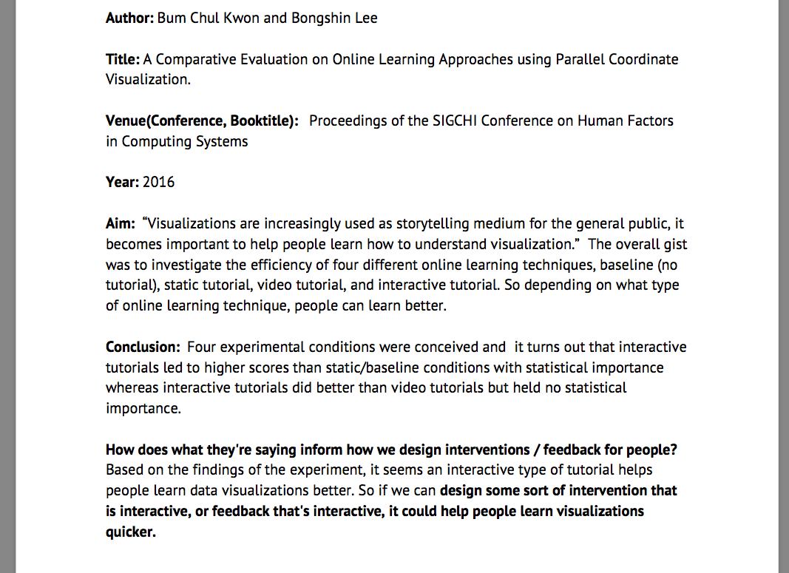

# The Annotated Bibliography: a Process, not a Product

For your final project, you should aim to cite at least 15 high quality research papers.
All should be closely related to your project.
When you write up your final project, there should be a "Background" or "Related Work" section which contains many of these papers.
This project will help you accomplish this.

## How to think about your Background / Related Work sections

The purpose of a Background section is to inform readers of __clusters__ of related work, and how your research adds to them.

Generally, a background section has the following structure:

- An introduction paragraph 
    - Summarize all clusters (1-2 sentences)
    - Describe very briefly how they inform your approach (1-2 sentences)
- A subsection for each related work cluster (multiple paragraphs per cluster)
    - For each subsection, introduce via a short paragraph 1-2 sentences
    - Then cover the major themes, each in a paragraph
    - Ensure for each paragraph, ensure that you mention either how it informs your work, or how your work differs
    - For longer subsections, end with a summarization paragraph
    - (Some clusters may be smaller, and require only a single, larger paragraph to capture.)
- After all subsections, include a transition paragraph
  - Summarize how prior work informs your current approach
  - Remind readers of the motivation, and how it relates

**DO NOT** simply summarize each paper in sentence after sentence.

You need at least two background clusters for a compelling paper.
There is a process you can follow to extract these: the annotated bibliography.

## The Annotated Bibliography

As you collect and read papers, it helps to ensure that your effort lasts.
An annotated bibliography is a process by which you capture the main ideas of a paper and how they relate to your work.

There are many ways of constructing an annotated bibliography.
For this project, I'm providing a minimal template.
**You can add to this template if it suits your project- just keep the original form.**

In Google Docs, LaTeX, or some other editor:

- Create one entry per page, containing:
  - Authors
  - Title
  - Venue (conference, booktitle, etcetera)
  - Year
  - Number Citations 
    - (This should be how many people *have cited* the work- usually found in Google Scholar)
  - The Aim of the paper (1 paragraph)
      - This should contain the stated goals of the paper, and how they went about it.
  - Conclusion (1 paragraph)
      - This should summarize the results and conclusion of the paper.
  - How the work informs your project (1 paragraph)

# An Example

The example entry below is from a project where we were examining how feedback improves peoples low-level judgments with charts.
Basically, when a person got an answer wrong on a task like your Assignment 3, we wanted to give them proper feedback so they do better next time.

(Note: this entry is missing citation count.)

# Refresher on conducting a literature review

- Literature finding techniques:
    - Searching from nothing
        - Use Google Scholar
        - Use the tools listed at the end of this doc
    - Starting with a "seed" paper (a paper you want to build off of)
    - Searching backwards
        - Read your seed's references and find relevant, high quality papers that may suit your project
        - These are new "seeds"
    - Searching forwards
        - Find your paper on Google Scholar
        - Click the "Cited By" link
            - These are papers that have cited your seed paper after it was published.
            - Occasionally this can turn up newer, high quality work.

# Advice on Paper Quality

- Judging Quality:
    - Look for reputable venues
        - Journals/Conferences are top; Symposiums second; Workshops third
    - (Note! Some journals / conferences are not reputable and very low quality)
    - In Visualization, look for these venues:
        - IEEE TVCG, InfoVis, VAST, SciVis, EuroVis, UIST, IUI, ACM CHI
        - (Generally IEEE or ACM venues are "good")

- Old is not always better. 
    - Many papers are written by junior folks. They over cite old work and refer to them as the seminal work in the field. 
        - Low sample sizes in papers are a good indicator of quality
- New is not always better. 
    - Just because a paper is newer does not mean it is the final authority on the matter.
- Look for friends over citing friends
    - Sometimes papers will over cite their own work and work of their friends.
    - Make sure citations are high quality and relevant to the task at hand.
- Remember that citations accrue over time
    - A 2014 paper with 50 citations is likely much better than a 2005 paper with 100 citations.

# Tools / links

- [My literature review guide](https://medium.com/@laneharrison/literature-reviews-why-and-how-10393940995f)
- http://citeomatic.semanticscholar.org/
- http://www.vispubdata.org/site/vispubdata/
- Example review paper: "A systematic review on the practice of evaluating visualization"

